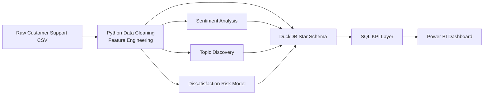
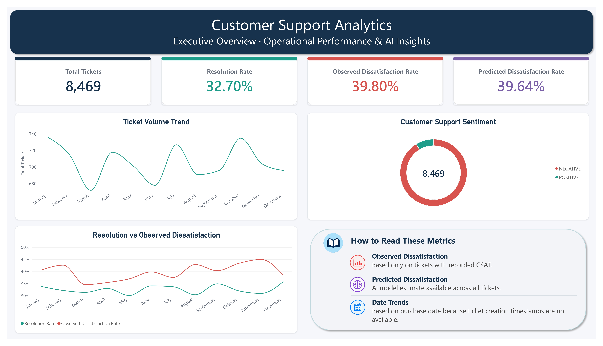
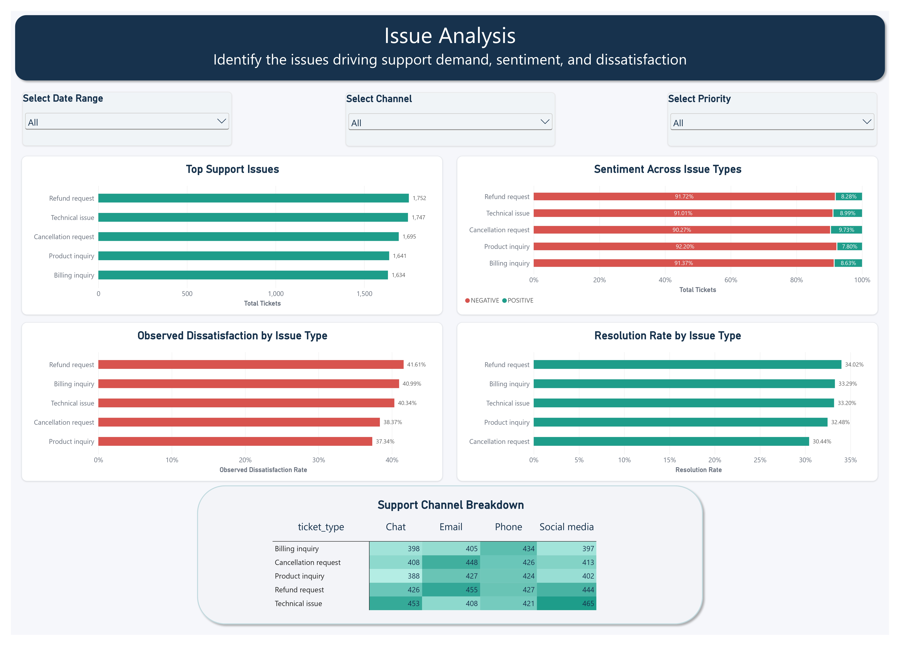
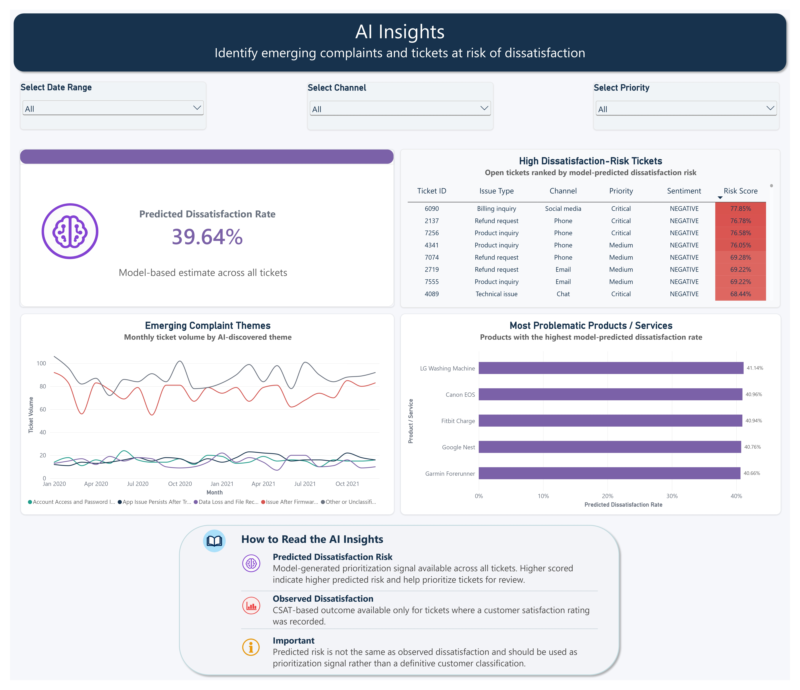
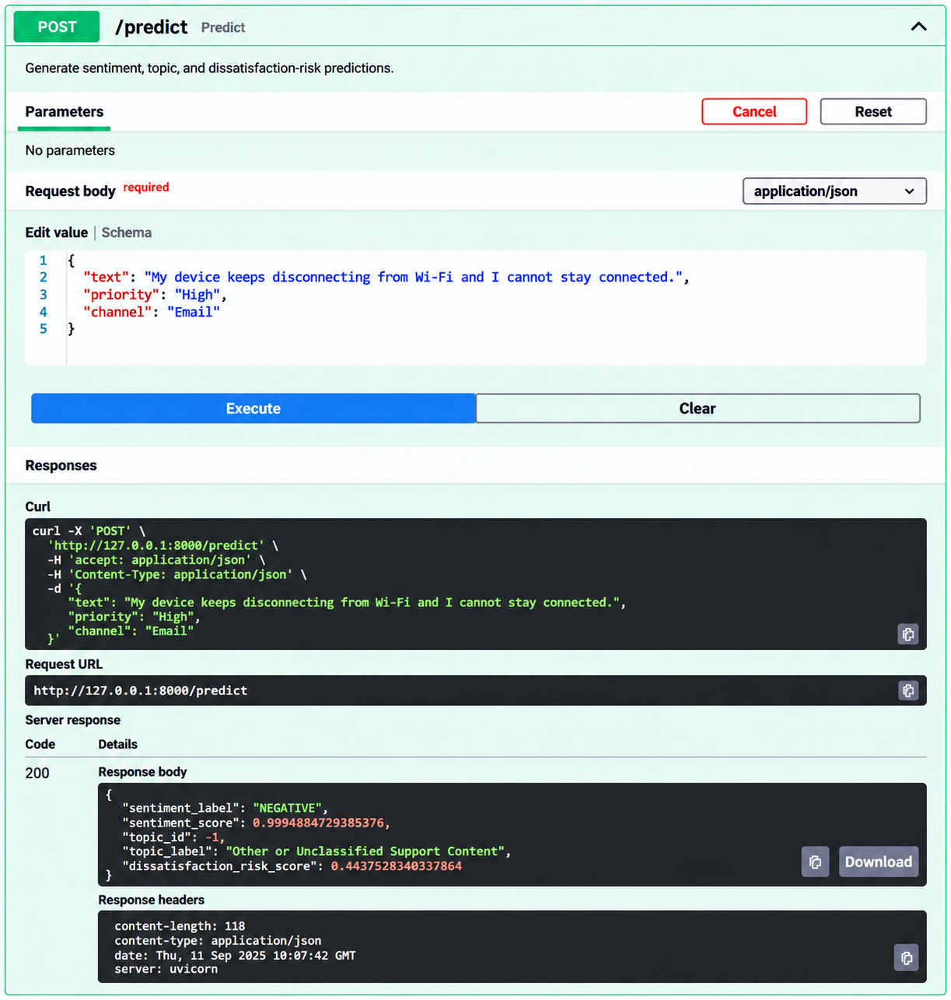

# AI-Powered Customer Support Analytics

An end-to-end customer support analytics project that combines SQL, Python-based NLP, predictive modeling, and Power BI to help support teams understand customer issues, monitor service performance, and prioritize tickets that may be at higher risk of dissatisfaction.

The project transforms **8,469 customer support tickets** into a validated analytical data layer containing operational ticket attributes and three AI-derived signals:

- Sentiment classification
- Support-topic discovery
- Predicted dissatisfaction risk

These outputs are integrated into a **DuckDB star schema** and surfaced through a three-page **Power BI dashboard** covering executive performance, issue analysis, and AI-driven support insights.

A key engineering decision was made during the project after data profiling showed that the source dataset did not contain enough reliable information to define a defensible escalation label. Rather than fabricate an escalation target, the project was re-scoped to a **CSAT-grounded dissatisfaction target** while preserving the original business objective: proactively identifying and prioritizing support tickets that may require attention.

## Business Problem

Customer support teams need to answer several operational questions quickly:

- How many support tickets are being received?
- How effectively are tickets being resolved?
- Which issues and support channels generate the most ticket volume?
- What does customer sentiment look like across support interactions?
- Which complaint themes are emerging?
- Which tickets may be at higher risk of customer dissatisfaction?
- Which products or services show elevated predicted dissatisfaction risk?

Traditional ticket reporting can summarize volume, status, channel, and priority, but it does not fully leverage the unstructured text contained in customer support descriptions.

This project adds an AI/NLP layer to convert ticket text into analytical signals that can be combined with structured support data.

The intended business use case is **support prioritization and issue discovery**, not automated decision-making about individual customers.

## Solution

The solution combines data engineering, NLP, predictive modeling, SQL analytics, and business intelligence into one end-to-end workflow.

### Analytical capabilities

1. **Data cleaning and feature engineering**
   - Standardizes ticket metadata and text.
   - Removes analytical fields that are not required for downstream reporting.
   - Creates lifecycle indicators such as response availability, resolution status, and CSAT availability.
   - Creates the observed dissatisfaction target from available CSAT ratings.

2. **Sentiment analysis**
   - Applies a pretrained sentiment-analysis pipeline to cleaned ticket descriptions.
   - Produces a sentiment label and confidence score for every ticket.
   - Uses the model as an analytical feature rather than treating predictions as ground truth.

3. **Topic discovery**
   - Uses BERTopic to discover recurring support themes.
   - Applies conservative topic-specific preprocessing to reduce templated text, URLs, placeholders, generic support boilerplate, and unrelated scraped/code artifacts.
   - Reduces fragmented topics and assigns human-readable labels.
   - Produces a fixed ticket-level topic output for downstream analytics.

4. **Dissatisfaction-risk modeling**
   - Uses observed CSAT-derived dissatisfaction as the supervised target.
   - Trains only on tickets where CSAT is available.
   - Combines structured ticket attributes with sentiment and topic features.
   - Selects Gradient Boosting as the final predictive model.
   - Scores the complete ticket population at inference time.

5. **SQL analytical layer**
   - Integrates operational and AI-derived fields into a DuckDB star schema.
   - Provides reusable KPI queries for dashboard reporting.
   - Separates observed CSAT-based dissatisfaction from model-predicted dissatisfaction risk.

6. **Power BI dashboard**
   - Provides three analytical pages:
     - Executive Overview
     - Issue Analysis
     - AI Insights
   - Supports interactive filtering by date, channel, and priority.
   - Provides both operational and AI-derived views.

7. **Local API demonstration**
   - A lightweight FastAPI application demonstrates local inference.
   - The `/predict` endpoint accepts ticket text, priority, and channel.
   - It returns sentiment, topic, and dissatisfaction-risk predictions.
   - This is a local demonstration only and is not presented as a production deployment.

## Key Results

### Dataset

The project uses a customer-support ticket dataset containing 8,469 records and 17 source columns.

The final analytical dataset contains 8,469 unique tickets after cleaning and feature engineering.

Key source limitations identified during profiling include missing CSAT values, incomplete lifecycle timestamps, templated ticket descriptions, and the absence of a defensible escalation label.

| Metric | Result |
|---|---:|
| Source rows | 8,469 |
| Final analytical rows | 8,469 |
| Unique Ticket IDs | 8,469 |
| Duplicate Ticket IDs | 0 |
| Full-row duplicates | 0 |
| Final processed columns | 20 |
| Topic assignments | 8,469 |
| Dissatisfaction-risk scores | 8,469 |

The processed dataset preserves one analytical record per unique support ticket.

### Core Support KPIs

| KPI | Result |
|---|---:|
| Total Tickets | 8,469 |
| Resolution Rate | 32.70% |
| CSAT-observed tickets | 2,769 |
| Observed Dissatisfaction Rate | 39.80% |
| Average Predicted Dissatisfaction Risk | 39.64% |
| Negative Sentiment | 7,733 tickets / 91.31% |
| Positive Sentiment | 736 tickets / 8.69% |

**Important:** Observed Dissatisfaction Rate and Predicted Dissatisfaction Rate are different metrics with different meanings and denominators.

- **Observed Dissatisfaction Rate** is calculated from tickets with an observed CSAT value.
- **Predicted Dissatisfaction Rate** is based on the average model-generated dissatisfaction-risk score across the analytical population.

They should not be interpreted as interchangeable measures.

## AI Model Results

### Sentiment Analysis

A pretrained sentiment-analysis pipeline was applied to all **8,469** cleaned ticket descriptions.

Output:

- `NEGATIVE`: 7,733 tickets (**91.31%**)
- `POSITIVE`: 736 tickets (**8.69%**)
- Missing sentiment labels: 0
- Missing sentiment scores: 0

A targeted manual validation sample of 20 tickets achieved:

- 10 / 20 agreements
- 50.0% agreement rate

This sample was intentionally used as a diagnostic validation check and should **not** be interpreted as an estimate of overall model accuracy.

The observed result also highlighted the limitations of applying a general-domain sentiment model to customer-support text.

### Topic Discovery

BERTopic was selected after a supervised TF-IDF + Logistic Regression baseline did not generalize effectively to unseen tickets.

The final topic output contains:

- 8,469 ticket assignments
- 30 topic IDs, including the `-1` outlier topic
- 0 missing topic labels

Discovered support themes include areas such as:

- Firmware-update issues
- Application issues after troubleshooting
- Account access and password problems
- Data loss and file recovery
- Error messages and error codes
- Wi-Fi and connectivity issues
- Security and data-safety concerns
- Charging and battery problems
- Software bugs and application crashes
- Hardware malfunction
- Screen and display problems
- Device power-on issues
- Repair and replacement concerns
- Refund and exchange requests
- Invoice and payment issues
- Email and account issues

The `-1` topic is labeled **Other or Unclassified Support Content**.

Topic IDs are model-generated identifiers and are treated as **categorical values**, not ordinal measures of severity or importance.

### Dissatisfaction-Risk Model

The supervised target is:

```text
is_dissatisfied
```

Target definition:

- `1` = CSAT ≤ 2
- `0` = CSAT ≥ 3
- Missing = CSAT unavailable

Training population:

- CSAT-observed tickets: **2,769**
- Model fitting set: **2,215**
- Evaluation set: **554**
- Split: stratified 80/20
- Random state: 42

Final model:

**Gradient Boosting Classifier**

Selected classification threshold:

**0.30**

Performance at the selected threshold:

| Metric    | Dissatisfied Class |
| --------- | ------------------: |
| Precision |              0.3988 |
| Recall    |              0.9136 |
| F1-score  |              0.5552 |
| Accuracy  |              0.4188 |

Model selection was based on observed Average Precision:

| Model                         | Average Precision |
| ------------------------------ | -----------------: |
| Gradient Boosting              |              0.4169 |
| Logistic Regression            |              0.3995 |
| Balanced Logistic Regression   |              0.3988 |

The model's selected threshold emphasizes **recall** so that a large proportion of potentially dissatisfied tickets can be surfaced for review.

The trade-off is substantial false-positive volume, reflected in the relatively low precision.

Therefore:

> The dissatisfaction-risk model is a **prioritization signal**, not a definitive classification of customer dissatisfaction.

## Architecture

The project follows a batch-oriented analytical architecture:



### Data flow

```text
Raw ticket data
      ↓
Data cleaning and feature engineering
      ↓
 ┌───────────────┬────────────────┬──────────────────────┐
 ↓               ↓                ↓
Sentiment     Topic Discovery   Dissatisfaction Risk
 ↓               ↓                ↓
 └───────────────┴────────────────┴──────────────────────┘
                         ↓
                  DuckDB Star Schema
                         ↓
                    SQL KPI Layer
                         ↓
                  Power BI Dashboard
```

The architecture intentionally keeps the AI layer connected to the same analytical spine as the rest of the project rather than treating NLP and predictive modeling as separate standalone experiments.

## Data Model

The SQL layer uses a star schema centered on `fact_ticket`.

### Fact table

`fact_ticket`

Contains one row per unique support ticket and combines:

- Ticket metadata
- Customer attributes available in the source
- Support channel
- Ticket priority
- Ticket status
- Resolution information
- CSAT information
- Lifecycle indicators
- Sentiment outputs
- Topic outputs
- Dissatisfaction-risk scores

### Dimension tables

- `dim_category`
- `dim_channel`
- `dim_priority`
- `dim_date`

The dimension relationships provide reusable analytical slicing for Power BI and SQL reporting.

### Date modeling note

`dim_date` represents **Date of Purchase**.

It is **not** treated as a ticket creation date because the source dataset does not contain a defensible ticket creation timestamp.

## Observed vs. Model-Derived Fields

This distinction is central to the project.

### `is_dissatisfied`

An observed outcome derived from available Customer Satisfaction Ratings.

```text
1 = CSAT ≤ 2
0 = CSAT ≥ 3
NULL = CSAT unavailable
```

This field is used as the supervised target for the dissatisfaction-risk model.

### `dissatisfaction_risk_score`

A model-generated score available for the complete analytical ticket population.

Higher values indicate higher predicted dissatisfaction risk.

It is intended for:

- Ticket prioritization
- Risk-based analysis
- Support-team triage
- Dashboard exploration

It should **not** be interpreted as:

- Observed customer dissatisfaction
- A confirmed customer complaint
- A causal measure
- A definitive classification

## Scope Decision: Escalation → Dissatisfaction Risk

The original project concept included an escalation-risk prediction target.

During data profiling, the available fields were examined to determine whether an explicit or defensible escalation label could be constructed.

The dataset did not provide a reliable escalation indicator.

In particular:

- There was no explicit `is_escalated` field.
- No defensible escalation event/status could be derived from the available ticket fields.
- Timestamp-derived lifecycle metrics were unreliable because approximately 49% of records with both relevant timestamps had invalid chronological ordering.
- The dataset did not contain a defensible ticket creation timestamp.
- `Date of Purchase` could not reasonably be substituted for ticket creation time.

Creating an escalation target under these conditions would have introduced a fabricated label into the supervised learning problem.

### Engineering decision

The project therefore re-scoped the target from:

```text
is_escalated
```

to:

```text
is_dissatisfied
```

where dissatisfaction is grounded in observed CSAT.

This is a **data-driven scope correction, not a reduction of the business objective**.

The business objective remains:

> Identify support tickets that may require additional attention so support teams can prioritize potentially at-risk interactions.

The revised target provides an observable outcome that can be defended analytically instead of creating a synthetic escalation label without sufficient evidence.

## Training Population vs. Inference Population

Another important design decision is the separation between the model's training population and its inference population.

### Training

The dissatisfaction-risk model was trained only on tickets with observed CSAT:

```text
2,769 CSAT-observed tickets
```

Within that population:

```text
Training:   2,215 tickets
Evaluation:   554 tickets
```

### Inference

After training, the saved model was used to generate:

```text
8,469 dissatisfaction-risk scores
```

for the full analytical population.

This is possible because the model uses features that are available for inference without requiring an observed CSAT value.

### Why this matters

The model is therefore:

- **trained on a labeled subset**
- **evaluated on a held-out portion of that labeled subset**
- **applied to the complete ticket population**

The model's predictions on tickets without observed CSAT are predictions, not newly observed dissatisfaction labels.

## Power BI Dashboard

The project contains three dashboard pages.

### 1. Executive Overview

The Executive Overview provides a leadership-level summary of customer-support performance.



Key components include:

- Total Tickets
- Resolution Rate
- Observed Dissatisfaction Rate
- Predicted Dissatisfaction Rate
- Ticket Volume Trend
- Customer Support Sentiment
- Resolution vs. Observed Dissatisfaction trend
- Metric interpretation guidance

The page is designed to answer:

> What is happening across the support operation at a high level?

### 2. Issue Analysis

The Issue Analysis page focuses on operational problem areas.



Visuals include:

- Top Support Issues
- Sentiment Across Issue Types
- Observed Dissatisfaction by Issue Type
- Resolution Rate by Issue Type
- Support Channel Breakdown

Interactive slicers:

- Date Range
- Channel
- Priority

The page is designed to answer:

> Which issues and channels are driving support workload and customer dissatisfaction?

### 3. AI Insights

The AI Insights page focuses on model-derived signals.



Visuals include:

- Predicted Dissatisfaction Rate
- High Dissatisfaction-Risk Tickets
- Emerging Complaint Themes
- Most Problematic Products / Services
- AI metric interpretation guidance

Interactive slicers:

- Date Range
- Channel
- Priority

The page also includes tooltip guidance explaining the difference between:

- `dissatisfaction_risk_score` — model prediction
- `is_dissatisfied` — observed CSAT-based outcome

The emerging-theme view uses a **monthly** trend because the weekly view was too noisy for useful interpretation.

## Tech Stack

| Layer               | Technology                | Purpose                                |
| -------------------- | -------------------------- | --------------------------------------- |
| Data preparation    | Python, Pandas            | Cleaning and feature engineering       |
| Sentiment           | Hugging Face Transformers | Pretrained sentiment inference         |
| Topic discovery     | BERTopic                  | Unsupervised support-theme discovery   |
| Predictive modeling | scikit-learn              | Dissatisfaction-risk modeling          |
| Database            | DuckDB                    | Analytical star schema                 |
| SQL                 | SQL                        | KPI and reporting queries              |
| BI                  | Power BI                  | Interactive dashboard                  |
| Calculations        | DAX                        | Dashboard measures                     |
| API demo            | FastAPI                   | Optional local inference demonstration |
| Model persistence   | Joblib                     | Saved model artifacts                  |

## AI Components

### Sentiment Classification

**Purpose:** Estimate whether a ticket description expresses positive or negative sentiment.

**Approach:** Pretrained sentiment-analysis pipeline.

**Output:**

- `sentiment_label`
- `sentiment_score`

**Use:** Analytical segmentation and sentiment reporting.

**Important limitation:** General-domain sentiment models can perform poorly on noisy, templated, domain-specific customer-support language.

### Topic Discovery

**Purpose:** Discover recurring support themes from ticket descriptions.

**Approach:** BERTopic with conservative text preprocessing and topic reduction.

**Output:**

- `topic_id`
- `topic_label`

**Use:** Complaint-theme analysis, issue categorization, and emerging-theme monitoring.

**Important limitation:** Topic assignments are exploratory and some clusters remain semantically mixed.

### Dissatisfaction Risk

**Purpose:** Estimate model-derived dissatisfaction risk for a ticket.

**Approach:** Gradient Boosting Classifier.

**Target:** `is_dissatisfied`

**Features:**

- Ticket Priority
- Ticket Channel
- `sentiment_label`
- `topic_id`
- `sentiment_score`

**Threshold:** 0.30

**Use:** Prioritization and risk-based support analysis.

**Important limitation:** The model is trained on only the CSAT-observed subset and should not be treated as a definitive classification system.

## Model Documentation

Detailed model documentation is maintained in:

```text
models/model_card.md
```

The model card documents:

- Model purpose
- Target definition
- Training population
- Evaluation population
- Input features
- Performance
- Model selection
- Threshold selection
- Feature importance
- Limitations
- Intended use

The dissatisfaction-risk model artifact is:

```text
models/dissatisfaction_risk_model.pkl
```

The selected threshold and related metadata are stored in:

```text
models/dissatisfaction_risk_threshold.json
```

## Data Quality & Analytical Decisions

Several important data-quality issues were identified during profiling.

### Missing data

The original dataset contains substantial missingness:

- `Resolution`: 5,700 missing
- `Time to Resolution`: 5,700 missing
- `Customer Satisfaction Rating`: 5,700 missing
- `First Response Time`: 2,819 missing

Missingness is associated with ticket status and is therefore retained rather than blindly imputed.

### Customer information

`Customer Name` and `Customer Email` were removed from the analytical dataset because they were not required for the project objectives.

### Duplicate records

No fully duplicated rows were found.

No duplicate Ticket IDs were found.

### Ticket timestamps

Timestamp-derived resolution duration was not created because approximately 49% of records with both relevant timestamps showed invalid chronological ordering.

### Ticket age

A ticket-age metric was not created because the dataset does not provide a defensible ticket creation timestamp.

`Date of Purchase` is therefore used only as the project's analytical date dimension.

### Escalation

An explicit escalation indicator could not be defensibly derived and was therefore not created.

## Limitations

### Dataset limitations

- The dataset contains substantial missing CSAT values.
- Only **2,769 of 8,469 tickets** have observed CSAT and can therefore contribute to supervised dissatisfaction-risk training.
- The source ticket descriptions contain templated language and placeholder text.
- Some ticket descriptions contain scraped, unrelated, or code-like artifacts.
- There is no defensible ticket creation timestamp.
- Timestamp ordering prevents reliable construction of certain lifecycle-duration metrics.
- There is no explicit escalation label.

### Sentiment limitations

The sentiment model is pretrained and general-domain.

Observed limitations include:

- Domain mismatch
- Very short or noisy text
- Templated language
- Surface-level positive wording affecting predictions
- Customer-support language that may not follow ordinary sentiment patterns

The 20-ticket manual validation sample achieved 50% agreement and should be interpreted only as a targeted diagnostic check.

### Topic-model limitations

- Some discovered topics remain semantically mixed.
- Human-readable topic labels are interpretations rather than ground truth.
- The `-1` outlier topic is not a single coherent support issue.
- Topic IDs may change if the topic model is retrained with different data, preprocessing, or parameters.
- The exported topic assignments are therefore treated as the fixed output of this modeling run.

### Dissatisfaction-risk limitations

- The model is trained only on CSAT-observed tickets.
- The CSAT-observed subset may not fully represent the complete ticket population.
- Threshold-specific performance was selected using the same test set used for evaluation.
- Independent validation is required before production deployment.
- Low precision means the model generates a substantial number of false-positive risk flags.
- Feature importance indicates relative model contribution, not causality.
- Predictions should be used for prioritization rather than definitive customer classification.

## Future Work

If additional data and development time were available, the next improvements would include:

### 1. Obtain a true escalation label

If the support organization provided reliable escalation events, the project could introduce a separately defined escalation target and evaluate:

- Escalation probability
- Escalation rate
- Escalation drivers
- Escalation by issue/channel/priority

This would allow the original escalation business question to be addressed directly without relying on a fabricated proxy.

### 2. Improve training coverage

Collecting CSAT more consistently would increase the supervised training population and reduce the gap between:

- labeled training population
- full inference population

### 3. Improve sentiment validation

Create a larger, domain-specific manually labeled validation dataset and evaluate:

- Precision
- Recall
- F1
- Confusion matrix
- Performance by ticket type/channel

### 4. Improve topic quality

Future iterations could explore:

- Better domain-specific embeddings
- More systematic topic labeling
- Hierarchical topic structures
- Topic stability analysis
- Human review of ambiguous clusters

### 5. Improve dissatisfaction-risk validation

Use an independent validation dataset or future-period holdout to assess:

- Threshold stability
- Precision-recall trade-offs
- Calibration
- Performance drift
- Generalization to new ticket populations

### 6. Add operational lifecycle data

A production implementation would benefit from reliable:

- Ticket creation timestamp
- First-response timestamp
- Resolution timestamp
- Escalation event timestamp
- SLA target
- SLA breach status

These fields would support stronger response-time, SLA, and escalation analytics.

### 7. Productionize the inference pipeline

The current API is a local demonstration.

A production implementation could add:

- Model versioning
- Automated model loading
- Data validation
- Monitoring
- Logging
- Batch or streaming inference
- Model performance monitoring
- Drift detection
- Secure API deployment

## Optional Local API Demo

A lightweight FastAPI demo is included as an optional stretch component.

The API exposes:

```text
GET  /
GET  /health
POST /predict
```

The `/predict` endpoint accepts:

```json
{
  "text": "The application keeps crashing after the update.",
  "priority": "High",
  "channel": "Email"
}
```

and returns:

```json
{
  "sentiment_label": "...",
  "sentiment_score": 0.0,
  "topic_id": 0,
  "topic_label": "...",
  "dissatisfaction_risk_score": 0.0
}
```

The API combines:

1. Sentiment inference
2. Topic inference using the persisted compatibility classifier
3. Dissatisfaction-risk scoring using the saved project model

The API is intended for **local demonstration only** and is not a production service.

### API Screenshot



## Project Structure

```text
ai-customer-support-analytics/
│
├── README.md
│
├── app/
│   └── api.py
│
├── data/
│   ├── raw/
│   │   └── customer_support_tickets.csv
│   │
│   ├── processed/
│   │   ├── customer_support_tickets_cleaned.csv
│   │   ├── ticket_sentiment.csv
│   │   ├── customer_support_topics.csv
│   │   └── ticket_dissatisfaction_risk.csv
│   │
│   └── powerbi/
│       ├── dim_category.csv
│       ├── dim_channel.csv
│       ├── dim_date.csv
│       ├── dim_priority.csv
│       └── fact_ticket.csv
│
├── docs/
│   ├── data_dictionary.md
│   └── schema_diagram.md
│
├── models/
│   ├── dissatisfaction_risk_model.pkl
│   ├── dissatisfaction_risk_threshold.json
│   ├── topic_inference_demo.pkl
│   └── model_card.md
│
├── notebooks/
│   ├── 01_data_cleaning.ipynb
│   ├── 02_sentiment_analysis.ipynb
│   ├── 03_topic_modeling.ipynb
│   └── 04_dissatisfaction_risk.ipynb
│
├── outputs/
│   └── screenshots/
│       ├── executive_overview.jpg
│       ├── issue_analysis.jpg
│       ├── ai_insights.jpg
│       └── api_demo.png
│
├── powerbi/
│   ├── dashboard.pbix
│   └── assets/
│       └── icons/
│           ├── date_trends_icon.png
│           ├── important_note_icon.png
│           ├── metrics_book_icon.png
│           ├── observed_dissatisfaction_icon.png
│           └── predicted_dissatisfaction_icon.png
│
├── reports/
│   └── business_case.pdf
│
├── scripts/
│   ├── export_powerbi_tables.py
│   ├── generate_dissatisfaction_risk_scores.py
│   ├── load_star_schema.py
│   ├── train_topic_inference_demo.py
│   ├── validate_kpi_queries.py
│   └── _qa_dashboard_metrics.py
│
├── sql/
│   ├── schema.sql
│   └── kpi_queries.sql
│
└── requirements.txt
```

## Key Files

### Data preparation

```text
notebooks/01_data_cleaning.ipynb
```

Cleans and feature-engineers the analytical ticket dataset.

### Sentiment analysis

```text
notebooks/02_sentiment_analysis.ipynb
data/processed/ticket_sentiment.csv
```

Generates ticket-level sentiment predictions.

### Topic discovery

```text
notebooks/03_topic_modeling.ipynb
data/processed/customer_support_topics.csv
```

Discovers and labels recurring support themes.

### Dissatisfaction-risk modeling

```text
notebooks/04_dissatisfaction_risk.ipynb
models/dissatisfaction_risk_model.pkl
models/dissatisfaction_risk_threshold.json
```

Builds, evaluates, and persists the dissatisfaction-risk model.

### SQL layer

```text
sql/schema.sql
sql/kpi_queries.sql
scripts/load_star_schema.py
scripts/validate_kpi_queries.py
```

Creates the analytical star schema, integrates AI outputs, and validates KPI queries.

### Dashboard QA

```text
scripts/_qa_dashboard_metrics.py
```

Independently recomputes core dashboard metrics (resolution rate, CSAT-observed count, observed/predicted dissatisfaction, sentiment mix) directly against the DuckDB star schema, so Power BI figures can be cross-checked against SQL/Python calculations.

### Power BI

```text
powerbi/dashboard.pbix
powerbi/assets/icons/
```

Contains the three-page interactive dashboard, along with the custom icon assets used for its metric-guidance tooltips.

### API demo

```text
app/api.py
models/topic_inference_demo.pkl
scripts/train_topic_inference_demo.py
```

Provides the optional local inference demonstration.

## How to Run

### 1. Clone the repository

```bash
git clone <repository-url>
cd ai-customer-support-analytics
```

### 2. Create a virtual environment

Windows:

```powershell
python -m venv .venv
.venv\Scripts\Activate.ps1
```

macOS/Linux:

```bash
python -m venv .venv
source .venv/bin/activate
```

### 3. Install dependencies

```bash
pip install -r requirements.txt
```

### 4. Run the data-cleaning pipeline

Open:

```text
notebooks/01_data_cleaning.ipynb
```

and execute the notebook to produce:

```text
data/processed/customer_support_tickets_cleaned.csv
```

### 5. Run sentiment inference

Open:

```text
notebooks/02_sentiment_analysis.ipynb
```

The notebook produces:

```text
data/processed/ticket_sentiment.csv
```

### 6. Run topic discovery

Open:

```text
notebooks/03_topic_modeling.ipynb
```

The notebook produces:

```text
data/processed/customer_support_topics.csv
```

### 7. Train the dissatisfaction-risk model

Open:

```text
notebooks/04_dissatisfaction_risk.ipynb
```

The notebook trains and evaluates the model and saves:

```text
models/dissatisfaction_risk_model.pkl
models/dissatisfaction_risk_threshold.json
```

### 8. Generate full-population risk scores

```bash
python scripts/generate_dissatisfaction_risk_scores.py
```

This produces:

```text
data/processed/ticket_dissatisfaction_risk.csv
```

### 9. Build the DuckDB star schema

```bash
python scripts/load_star_schema.py
```

This integrates the cleaned data and AI outputs into the analytical star schema.

### 10. Validate KPI queries

```bash
python scripts/validate_kpi_queries.py
```

The validation script executes the seven KPI queries defined in:

```text
sql/kpi_queries.sql
```

### 11. Independently re-verify dashboard metrics (optional)

```bash
python scripts/_qa_dashboard_metrics.py
```

Recomputes the core Executive Overview metrics directly from DuckDB as a cross-check against the Power BI dashboard.

### 12. Export Power BI tables

```bash
python scripts/export_powerbi_tables.py
```

This exports:

```text
dim_category
dim_channel
dim_date
dim_priority
fact_ticket
```

to:

```text
data/powerbi/
```

### 13. Open the Power BI dashboard

Open:

```text
powerbi/dashboard.pbix
```

in Power BI Desktop.

The dashboard contains:

- Executive Overview
- Issue Analysis
- AI Insights

## Optional: Run the Local API Demo

From the project root:

```bash
uvicorn app.api:app --reload
```

Then open the local Swagger interface:

```text
http://127.0.0.1:8000/docs
```

Use:

```text
GET /health
```

to verify that the API is running.

Use:

```text
POST /predict
```

to generate:

- Sentiment
- Topic
- Dissatisfaction risk

## Validation

Validation was performed throughout the project rather than only at the end.

### Data validation

- 8,469 source tickets
- 8,469 processed tickets
- 8,469 unique Ticket IDs
- 0 duplicate Ticket IDs
- 0 full-row duplicates

### AI output validation

- 8,469 sentiment outputs
- 8,469 topic assignments
- 8,469 dissatisfaction-risk scores
- No missing sentiment labels
- No missing sentiment scores
- No missing topic labels
- No missing dissatisfaction-risk scores

### SQL validation

The KPI validation layer executes seven reporting queries:

1. Resolution Rate
2. Observed Dissatisfaction Rate
3. Predicted Dissatisfaction Rate
4. Sentiment Distribution
5. Emerging Themes
6. Sentiment Distribution by Channel
7. Top 5 Tickets by Predicted Dissatisfaction Risk

### Dashboard QA

The Power BI dashboard was independently cross-validated against SQL/Python calculations using `scripts/_qa_dashboard_metrics.py`.

QA covered:

- Executive Overview metrics
- Issue Analysis slicer behavior
- AI Insights slicer behavior
- KPI query execution
- Independent metric calculations
- Three-page dashboard walkthrough

No dashboard/KPI discrepancies were identified during the final QA pass.

## Business Interpretation

The project demonstrates how unstructured support text can become part of a conventional business analytics workflow.

Instead of treating NLP as an isolated machine-learning exercise:

```text
Customer Support Text
        ↓
AI-derived analytical signals
        ↓
Ticket-level analytical data
        ↓
SQL star schema
        ↓
Business KPIs
        ↓
Power BI
        ↓
Support prioritization and decision support
```

The practical value comes from combining:

- **What customers are talking about** → topics
- **How customers are expressing themselves** → sentiment
- **Which tickets may need attention** → dissatisfaction risk
- **Where operational workload occurs** → ticket metadata
- **How the support operation is performing** → business KPIs

## Business Use Cases

The resulting analytical layer can support several operational workflows.

### Support Team Leads

Use high dissatisfaction-risk scores to prioritize tickets for review.

### Operations Managers

Monitor ticket volume, resolution rate, dissatisfaction, and channel-level patterns.

### Customer Experience Teams

Investigate negative sentiment and recurring complaint themes.

### Product / Service Teams

Use topic and product-level analysis to identify recurring technical or service issues.

### Leadership

Use the Executive Overview to understand support performance and the AI Insights page to identify areas requiring deeper investigation.

## Responsible Use

The AI outputs in this project are designed for **decision support**, not autonomous decision-making.

The model outputs should not be used to:

- Automatically reject customers
- Automatically deny refunds
- Automatically classify a customer as dissatisfied
- Make high-impact decisions without human review

In particular, `dissatisfaction_risk_score` represents model-predicted risk and should be interpreted alongside the underlying ticket context.

Observed CSAT and model predictions must remain clearly separated.
