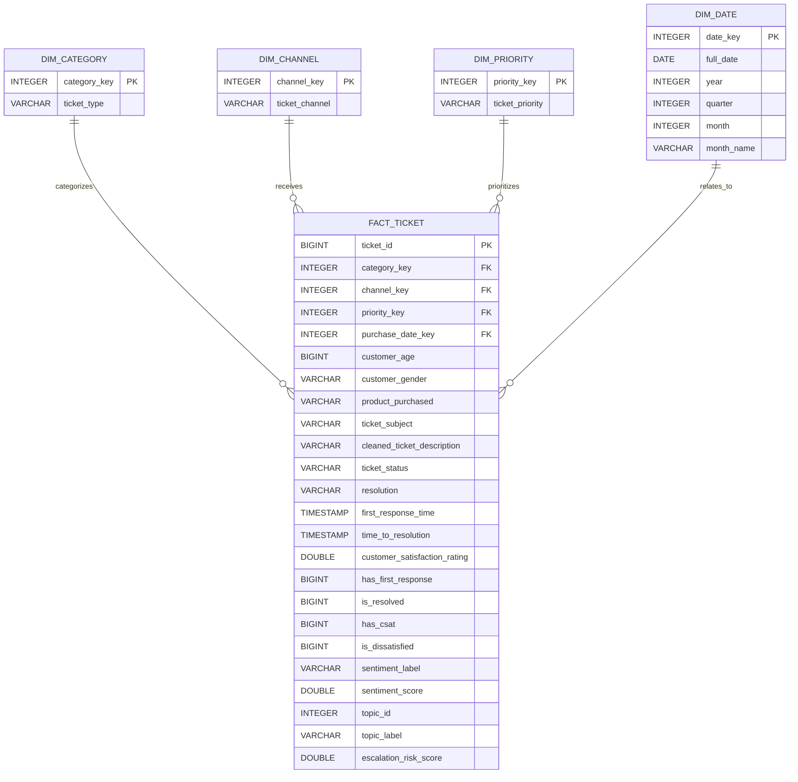

# Customer Support Analytics Star Schema

## Design Note

`DIM_DATE` represents **Date of Purchase**. It is not treated as a ticket creation date because the dataset does not contain a defensible ticket creation timestamp.